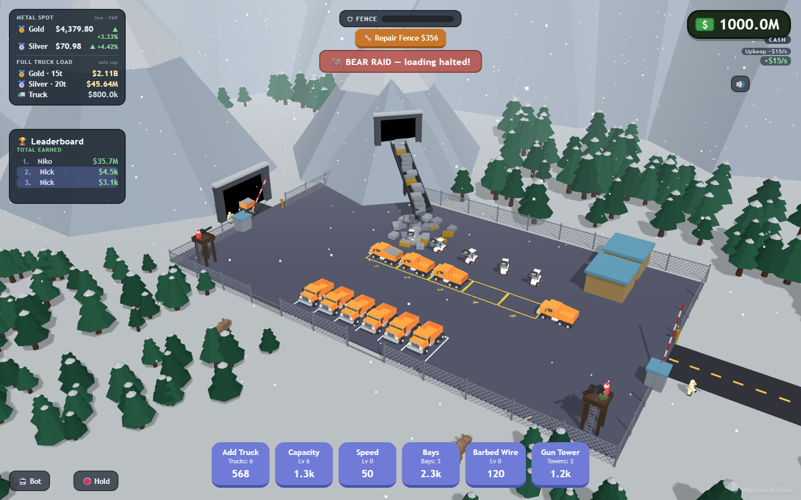
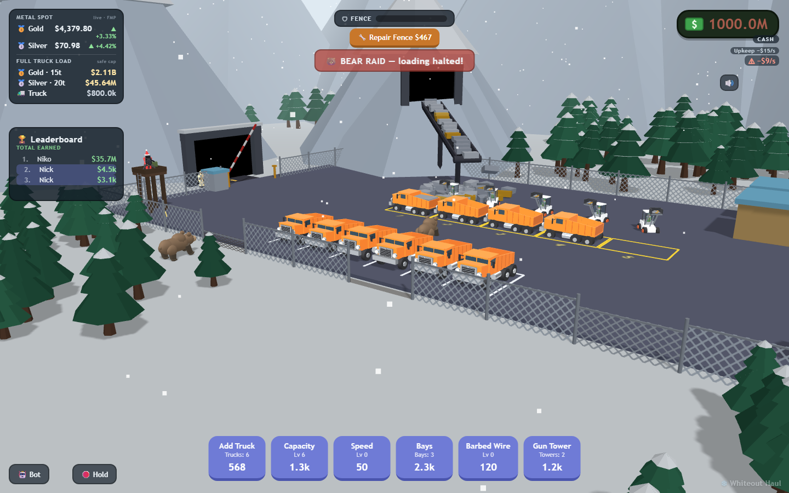
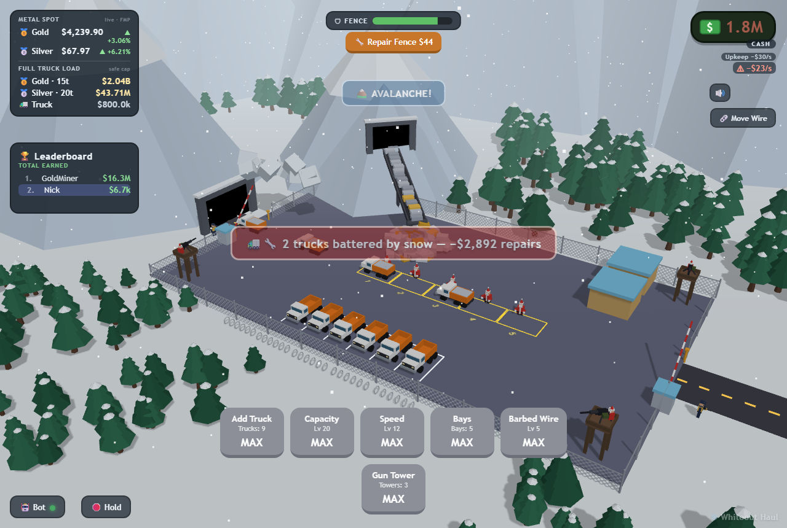
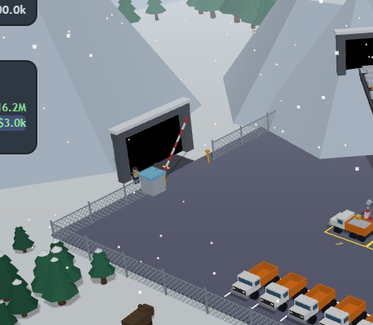
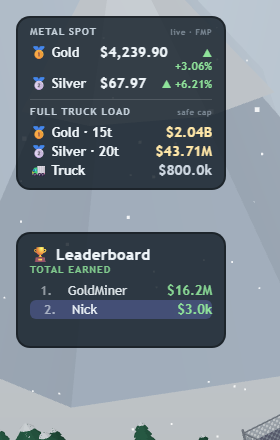
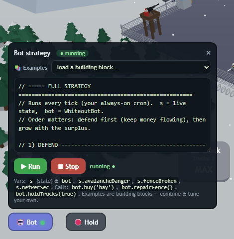
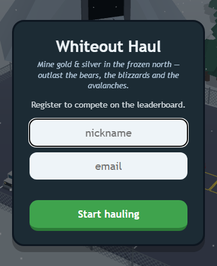

# ❄️ Whiteout Haul

*Mine gold & silver in the frozen north — outlast the bears, the blizzards and the avalanches.*

Whiteout Haul is a browser-based 3D idle/management game built with **Three.js** + **Vite** (vanilla JS, no framework). A conveyor pours silver and gold bricks onto a pile; orange Freightliner dump trucks queue at the loading bay, get loaded by elves driving wheel loaders, and drive off — each full load that departs pays out. You spend the proceeds on upgrades to haul faster, defend the site against wildlife and weather, and climb a global leaderboard.

The twist: running a mine costs money **every second** (wages, fuel), and the site is under constant threat (bear raids, avalanches). A human can't babysit it 24/7 — so the game ships with an in-browser **automation bot** ("cron") that keeps the operation alive while you're away.

---

## Screenshots

<table>
<tr>
<td width="50%"><br><b>Operations overview</b><br>The conveyor feeds the pile; Freightliner trucks queue at the bays while elves on wheel loaders tip gold/silver bars into them, and they haul off for cash. Fenced site with gun towers, a gated entrance and exit.</td>
<td width="50%"><br><b>Bear raid</b><br>Waves of bears prowl in and claw the perimeter fence while Santa-gunner <b>M134 minigun</b> towers fire back. A breach halts loading and blocks the lane until you repair.</td>
</tr>
<tr>
<td width="50%"><br><b>Avalanche</b><br>Snow crashes across the lane. Trucks caught moving are destroyed; <b>hold the convoy</b> to save them (here the bot held in time — the trucks were only "battered").</td>
<td width="50%"><br><b>Gated checkpoint</b><br>A boom gate with a guard booth and a far-side landing post; an armed M-16 guard stands watch. The exit road runs into the mountain tunnel.</td>
</tr>
<tr>
<td width="50%"><br><b>Live economy dashboard</b><br>Real-time FMP gold/silver spot prices with the day's change, the real-world value of a full safe load (15 t gold / 20 t silver), the truck cost, and the leaderboard.</td>
<td width="50%"><br><b>Automation bot ("cron")</b><br>The in-game scripting panel with a library of strategy building blocks. A running script keeps the operation alive 24/7 — holding for avalanches, repairing breaches, and expanding.</td>
</tr>
<tr>
<td width="50%"><br><b>Registration</b><br>Pick a nickname + email (validated, never shown) to compete on the global leaderboard ranked by total earnings.</td>
<td width="50%"></td>
</tr>
</table>

---

## Table of contents

- [Screenshots](#screenshots)
- [Running the game](#running-the-game)
- [The core loop](#the-core-loop)
- [Operations management (upgrades)](#operations-management-upgrades)
- [In-game economy](#in-game-economy)
- [Challenges & defenses](#challenges--defenses)
- [Automation — the bot / "cron"](#automation--the-bot--cron)
- [Real-world economy reference (live prices)](#real-world-economy-reference-live-prices)
- [Leaderboard](#leaderboard)
- [Sound](#sound)
- [HUD reference](#hud-reference)
- [Tuning reference](#tuning-reference)
- [Project structure](#project-structure)

---

## Running the game

**Requirements:** Node 18+ (Node 20+ recommended for built-in `fetch` in the server).

```bash
npm install
npm run dev        # Vite dev server -> http://localhost:5173
npm run server     # (optional) leaderboard + live-prices backend on :3001
```

- `npm run dev` runs the game. It works fully **without** the backend — the leaderboard and live metal prices just go quiet/offline.
- `npm run server` runs the zero-dependency backend (`server/leaderboard-server.mjs`) that stores leaderboard scores and proxies live gold/silver prices.

### Environment (`.env`, optional)

Only needed for **live metal prices** on the dashboard:

```
FMP_API_KEY=your_financial_modeling_prep_key
```

The server reads this from `.env` automatically (tiny built-in loader, no `dotenv` dependency). Without it, the price panel shows "offline" and the game is otherwise unaffected.

---

## The core loop

```
Conveyor  →  Pile  →  Truck loads at the bay  →  Truck drives off  →  $$$  →  Upgrades
```

1. A conveyor emerges from the mountain portal and pours **silver** bricks, with an occasional **gold** one (16% chance per brick).
2. Trucks drive in from the right, **queue bumper-to-bumper** at the loading bay (stop-and-go, one moves then the next).
3. The front truck(s) are loaded — bricks fly from the pile into the bed. **You earn nothing per brick.** Money is paid only when a **full truck drives off**, equal to the value of the bricks it carried (so a load that scooped up gold pays much more).
4. Trucks that leave recycle to the back of the queue, so the line stays full and traffic never loops endlessly — it's a continuous in/out flow.

Per-brick payout (default): **silver = $11**, **gold = $65**. With a 16% gold chance, the expected value is **~$19.6 per brick**.

---

## Operations management (upgrades)

Six upgrades, bought from the bottom HUD. Costs scale **geometrically**: `cost = baseCost × growth^level`.

| Upgrade | Effect | Base cost | Growth | Max | Notes |
|---|---|---:|---:|---:|---|
| **Add Truck** | +1 truck in the queue | $40 | 1.7× | 8 (→ 9 trucks) | More throughput, until the bay is the bottleneck |
| **Capacity** | +2 bricks per load | $55 | 1.7× | 20 (→ 46 bricks) | The long-tail money sink; biggest per-load payouts |
| **Speed** | Faster driving **and loading** | $50 | 1.6× | 12 | Loading speed (`loadTime`) is the real income lever |
| **Bays** | +1 parallel loading bay | $250 | 3.0× | 4 (→ 5 bays) | Powerful **throughput multiplier** — front N trucks load at once |
| **Barbed Wire** | Tougher fence + slows bear raids + installs coils | $120 | 1.8× | 5 | Defense (see below) |
| **Gun Tower** | Santa-gunner tower that auto-shoots bears | $300 | 2.0× | 3 | Defense (one per useful corner) |

**The bottleneck mindset:**
- **Trucks** raise throughput only until the **bay** can't keep them all fed. Then you need **Bays** (parallel loading) — the strongest single multiplier.
- **Capacity** raises the value of each load (and is the most expensive long-term sink).
- **Speed** mostly helps by shortening load time, which raises the bay's effective throughput.

---

## In-game economy

> **Note:** the in-game cash economy uses small, abstract numbers (cash in the hundreds → millions). It is **separate** from the live "real-world" dollar figures shown on the price panel — see [that section](#real-world-economy-reference-live-prices).

### Income
Truck deliveries are the income. A full load pays `(silver bricks × $11) + (gold bricks × $65)`. Throughput depends on trucks, bays, capacity and loading speed.

### Operating costs (the burn) ⚠️
Running the mine **costs cash every second** — salaries, fuel, electricity:

```
upkeep $/sec = 1.5  +  1.0 × trucks  +  1.5 × bays  +  0.6 × capacityLevel
```

- A running 1-truck/1-bay line earns ~$8/s and burns ~$4/s → comfortably **net positive**.
- If the line **stalls** (e.g. a bear breach blocks the lane and you don't repair), income stops but the burn continues — **cash slides toward $0 and you go bankrupt.**
- Upkeep only starts **after your first sale**, so the registration screen / cold start never drains you.

The HUD shows your **net $/sec** under the cash counter — green when profitable, red & pulsing ("⚠ −$/s") when you're bleeding.

### Starting state
- Starting cash: **$100**
- The leaderboard **score = total cash ever earned** (it only ever grows; spending doesn't reduce it).

---

## Challenges & defenses

The site is under constant threat. Ignoring any of these stops the money and bleeds your cash via upkeep.

### 🐻 Bear raids
- Bears wander in from the treeline in **waves of 2–3** (every ~9s at 0 barbed wire; rarer with more wire), from different directions, attacking the **front fence** (in clear view).
- They **claw a fence segment down** — panels visibly sag, tint, and collapse into a gap. The fence health bar (top-center) tracks the **weakest** stretch.
- **Breach!** When any segment is downed, bears **storm the dock**: they go after the elf loaders (who flee in panic) and **block the truck lane** so trucks physically can't pass. No trucks moving → no income → upkeep bleeds you.
- **Defenses:**
  - **Gun Towers** — Santa gunners on tripod-mounted **M134 miniguns** (with an access ladder up to the deck). They scan, track, and shoot bears within range (corners of the site).
  - **Gate Guards** — the two boom-gate guards carry **M-16s** and shoot bears near their posts. A bear that reaches a guard can **injure** them (they go down ~12s; **$300 replacement**).
  - **Barbed Wire** — concertina coils installed **in front of** the fence on the stretches gunfire can't reach (the front-center gap). Bears must chew through a coil first and get **shredded** doing it. **You can drag coils** to reposition them (🧷 Move Wire button), and they **take damage too** — torn wire is folded into the repair bill.
  - **🔧 Repair Fence** — a button (and bot action) that pays to restore the wire and panels and **drives off any bears that got inside**. Repair cost scales with total damage (remote-site materials premium).

### 🏔️ Avalanches
- On a timer (first at ~35s, then every ~45–70s), snow breaks off the mountain. A **warning** (~6s, pulsing banner + rumble) precedes the **impact** — snow crashes across the **exit corridor**.
- While snow is on the lane it's a **death zone**:
  - A truck caught **moving** through it is **destroyed** — it loses the gold/silver it was carrying **and** you pay a hefty **replacement** (≈8 full loads' worth, scales with capacity). Several trucks can be lost in one avalanche.
  - A truck that was **held** (stopped) but still sitting in the zone isn't destroyed, but takes a **dig-out/repair dent** (~20% of a replacement; keeps its cargo).
- **Defense — hold the trucks:** stop the convoy (🛑 **Hold** button, or `bot.holdTrucks(true)`) for the whole event (warning → impact → settle). Held trucks that are clear of the corridor take **zero** damage. Release when it clears.

### The big picture
Upkeep bleeds you 24/7, bears can halt the lane, and a single avalanche can wipe a fortune in trucks. Manual play **cannot** keep up around the clock — which is exactly why the game has automation.

---

## Automation — the bot / "cron"

Open the **🤖 Bot** panel (bottom-left). It's an in-game code editor: write a strategy, hit **Run**, and it executes **every game tick** — an always-on event reactor (the in-browser equivalent of a cron job).

### Background-proof
The simulation is driven by a **Web Worker**, not just `requestAnimationFrame`. rAF pauses when the tab is hidden — the worker does not — so your bot keeps reacting (and upkeep keeps running) **even when the tab is backgrounded or off-screen**. A running strategy is also **remembered across page reloads** (it auto-resumes).

### The API — `window.WhiteoutBot`
| Call | Does |
|---|---|
| `state()` | Snapshot of the whole operation (see below) |
| `buy(key)` | Buy an upgrade: `'truck' \| 'capacity' \| 'speed' \| 'bay' \| 'fence' \| 'tower'` |
| `repairFence()` | Pay to repair the fence + drive off intruding bears |
| `holdTrucks(bool)` | Hold/release the convoy (use during avalanches) |
| `setStrategy(fn)` | Register a function run every tick |
| `clearStrategy()` | Stop |
| `isRunning()` | Is a strategy active |

`state()` (the `s` argument in your strategy) includes: `cash`, `score`, `incomePerSec`, `burnPerSec`, `netPerSec`, `trucks`, `bays`, `capacityLevel`, `speedLevel`, `fenceLevel`, `towers`, `bearsActive`, `fenceHealth`, `fenceBroken`, `repairCost`, `avalanche` (state string), `avalancheDanger` (bool), `upgrades`, `costs`, `affordable`, `maxed`, and `brick` values.

### Example library
The panel ships a small library (📚 **Examples** dropdown). Selecting one loads **and runs** it. They're deliberately partial **building blocks** so you assemble (and tune) your own winning strategy:

- **Full strategy (defend + grow)** — the complete reference (default). Defends first (hold for avalanche, repair breaches), keeps a cash reserve, then expands by priority. *This is the one to study.*
- **Avalanche emergency** — just the hold reaction.
- **Fence repair** — just the auto-repair on breach.
- **Auto-expand (cheapest)** — greedy growth, no defense.
- **Keep a cash reserve** — expand only above a safety buffer.

The full strategy in a nutshell:
```js
// 1) DEFEND
bot.holdTrucks(s.avalancheDanger);                 // hold while snow is on the lane
if (s.fenceBroken && s.cash >= s.repairCost) { bot.repairFence(); return; }
// 2) RESERVE — never bankrupt yourself
const reserve = s.repairCost + s.burnPerSec * 25;
if (s.cash <= reserve) return;
// 3) GROW — best affordable upgrade out of the surplus, by priority
for (const k of ['bay','truck','capacity','speed','tower','fence'])
  if (s.affordable[k] && s.costs[k] <= s.cash - reserve) { bot.buy(k); break; }
```

The `priority` order and the `reserve` multiplier are the knobs that separate a good run from a leaderboard-topping one.

---

## Real-world economy reference (live prices)

The top-left panel shows **live gold/silver spot prices** (via the [Financial Modeling Prep](https://financialmodelingprep.com) API, proxied by the backend and cached 15 min) with the day's change, **plus the real-world dollar value of a full truck load**.

- Conversion: `value = tonnes × 32,150.7 troy oz/tonne × spot price`.
- **Safety caps per metal** (gold is denser & more valuable, so it's restricted harder):
  - 🥇 **Gold: 15 tonnes** per truck
  - 🥈 **Silver: 20 tonnes** per truck
- Real hauler reference: a ~30–40 t articulated dump truck (Cat 745 / Volvo A40 class), **~$800k**.

At a gold price of ~$4,240/oz this makes a full gold load worth **~$2 billion** and a silver load **~$44 million** — a reference for grounding the game in real commodity economics (the in-game cash economy is its own, smaller scale).

---

## Leaderboard

- On first launch you **register** with a nickname + email. The email is validated server-side (format, disposable-domain blocklist, DNS MX check) to cut down on fakes — **no email is ever sent**, and it's kept private (never shown on the board; used only as your unique player key).
- Your **score = total cash ever earned**. The client submits it every ~8 seconds; the server keeps your best.
- The board (top-left) shows the top players, total-earned, with you highlighted.
- **Reset** is **admin-only**: the Reset button appears only when an admin flag is set — visit once with `?admin=1` (persists in that browser; clear with `?admin=0`). A leaderboard wipe is server-side only.

---

## Sound

Sound is mostly **synthesized at runtime** via the Web Audio API:
- 🔫 a deep, sustained **M134 minigun roar** (towers) and a full-auto **M-16 rattle** (guards)
- 🐻 bear roar — a recorded growl sample (`public/bear-growl.mp3`), with a synth fallback
- 🚚 a deep diesel **engine bed** with rev (accel) and air-brake (stop) for the trucks
- 💰 a heavy **"payday"** plus a **metal-scrap clatter** as gold/silver bars land in the bed
- 🚨 breach alarm, 🏔️ avalanche rumble + crash

Audio unlocks on your first click/keypress (browser policy). Toggle with the **🔊 mute** button (top-right).

---

## HUD reference

| Area | What |
|---|---|
| Top-left | Live **metal spot prices** + **full-load values**, then the **Leaderboard** |
| Top-center | **Fence health** bar, **Repair Fence** button, **raid/avalanche** banners |
| Top-right | **Cash** + **net $/sec**; **🔊 mute**, **↻ Reset** (admin), **🧷 Move Wire** |
| Bottom | **Upgrade** buttons (center), **🤖 Bot** + **🛑 Hold** (left), faint wordmark (right) |

---

## Tuning reference

Almost everything is centralized in **`src/config.js`** — edit there to retune:

- `ECONOMY` — starting cash, upkeep burn, all six upgrades (base cost / growth / max)
- `BRICK` — silver/gold values + gold chance
- `TRUCK` — speed, capacity, queue spacing, load time
- `PILE` — the growing metal heap
- `BEARS` — spawn rate, speed, HP, tower range/fire rate
- `GUARDS` — rifle range/fire rate, injury chance, replacement cost
- `AVALANCHE` — timing, replacement multiple, held-truck dent fraction
- `REAL` — per-metal load caps + real truck cost (the live-price reference)
- `LEADERBOARD` — backend URL + submit interval
- `LAYOUT` / `CAMERA` / `COLORS` — world geometry and look

---

## Project structure

```
index.html                     # page shell + favicon link
public/favicon.svg             # snowflake + gold-core favicon
vite.config.js
src/
  config.js                    # ★ all tunables (economy, layout, challenges)
  main.js                      # entry point; wires modules; the game loop (Worker-driven)
  scene.js                     # Three.js world: ground, mountains, road, fence, gates, trees…
  trucks.js                    # the loading-queue convoy + avalanche crush/dent logic
  conveyor.js                  # the brick conveyor + falling pile
  economy.js                   # cash, upkeep burn, upgrades, score
  ui.js                        # currency counter, net readout, upgrade buttons
  bears.js                     # bear raids, fence damage, gun towers, guard combat, barbed wire
  avalanche.js                 # avalanche cycle + snow visuals
  prices.js                    # live FMP prices + real full-load values panel
  sfx.js                       # Web Audio sound synthesis
  bot.js                       # WhiteoutBot automation API
  botpanel.js                  # in-game bot editor + example library
  leaderboard.js               # registration modal + leaderboard panel
  style.css                    # all HUD styling
server/
  leaderboard-server.mjs       # zero-dep backend: scores + FMP price proxy
PLAN.md                        # original build plan
```

**Tech:** Three.js (r0.169), Vite 5, vanilla JS ES modules, a zero-dependency Node HTTP backend. Verification screenshots/scripts live in `verify/` (dev-only, not shipped).
